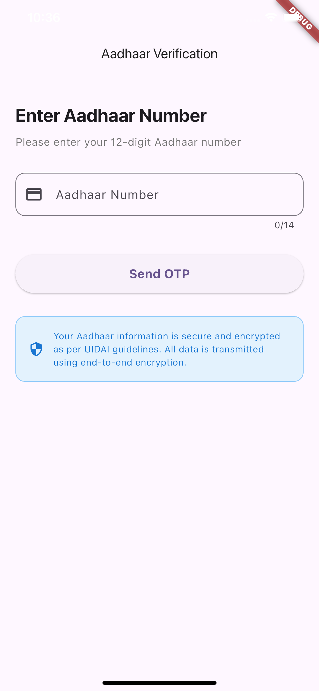
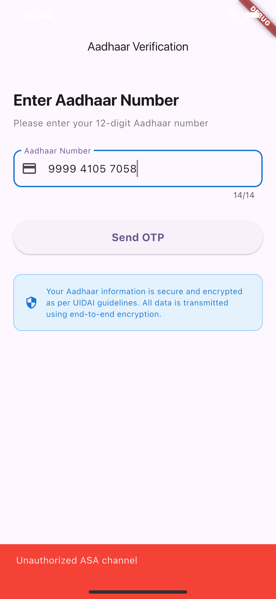

# Aadhaar Auth Service

A robust and secure **Flutter/Dart** package for integrating **Aadhaar-based Authentication (AUA)** and **e-KYC** services into your application.  
It provides a simple, high-level API to handle the complexity of UIDAI-compliant transactions, including **OTP** and **Biometric authentication**.

---

## UIDAI Documentation

- **Get test keys from here**
https://uidai.gov.in/hi/916-developer-section/data-and-downloads-section/11350-testing-data-and-license-keys.html

- https://uidai.gov.in/images/resource/aadhaar_otp_request_api_2_5.pdf
- https://uidai.gov.in/images/resource/aadhaar_authentication_api_2_5.pdf
- https://uidai.gov.in/images/resource/FAQs_Aadhaar_Data_Vault_v1_0_13122017.pdf

---

## 🚀 Features

- **OTP-Based Authentication** → Request and verify Aadhaar-linked OTPs.  
- **Biometric Authentication (RD Service)** → Seamless integration with UIDAI-compliant Registered Devices (fingerprint/iris).  
- **e-KYC Retrieval** → Securely fetch demographic data (Name, Address, DoB, Photo) with user consent.  
- **Secure & Compliant** → Fully adheres to UIDAI guidelines: digital signing, encryption, secure key management.  
- **Aadhaar Masking Utility** → Built-in helper to mask Aadhaar numbers (`XXXX XXXX 1234`).  

---

## 🛠️ Installation

### 1. Add Dependency

In your **pubspec.yaml**:

```yaml
dependencies:
  flutter:
    sdk: flutter
  aadhaar_auth_service: ^0.0.1 # Use the latest version
```

Then run:

```bash
flutter pub get
```

### 2. Platform Setup (Android/iOS)

#### Android
- Ensure `minSdkVersion` in `android/app/build.gradle` is set to **21 or higher**.  
- For Biometric support, declare necessary permissions in `AndroidManifest.xml`.

#### iOS
- Aadhaar ecosystem is primarily Android-focused.  
- For iOS, check **official UIDAI guidelines** for hardware/OS compatibility.

---

## ⚙️ Setup and Initialization

Initialize the service with **AUA/Sub-AUA credentials** before authentication:

```dart
import 'package:aadhaar_auth_service/aadhaar_auth_service.dart';

void main() {
  AadhaarAuthService.initialize(
    auaCode: 'YOUR_AUA_CODE',
    saCode: 'YOUR_SUB_AUA_CODE',
    licenseKey: 'YOUR_LICENSE_KEY',
    environment: Environment.STAGING, // or Environment.PRODUCTION
  );
  runApp(const MyApp());
}
```

---

## 💻 Usage Examples

### 1. OTP-Based Authentication

```dart
final service = AadhaarAuthService.instance;

try {
  // --- Step 1: Request OTP ---
  final otpRequest = await service.requestOtp(aadhaarOrVid: '123456789012');
  
  if (otpRequest.success) {
    print('OTP sent successfully. Transaction ID: ${otpRequest.txnId}');
  } else {
    print('OTP request failed: ${otpRequest.errorCode}');
  }

  // --- Step 2: Verify OTP ---
  final otpVerification = await service.verifyOtp(
    otp: '123456',
    txnId: otpRequest.txnId!,
  );

  if (otpVerification.success) {
    print('Authentication Successful!');
  } else {
    print('OTP Verification failed: ${otpVerification.errorCode}');
  }

} catch (e) {
  print('Unexpected error: $e');
}
```

---

### 2. e-KYC Retrieval (Demographic Data)

```dart
final service = AadhaarAuthService.instance;

try {
  final kycResponse = await service.fetchEkyc(
    txnId: 'TXN:202501010000000',
    consent: true, // User must explicitly consent
  );

  if (kycResponse.success && kycResponse.kycData != null) {
    final data = kycResponse.kycData!;
    print('KYC Successful. User: ${data.name}, Address: ${data.address}');
  } else {
    print('e-KYC failed: ${kycResponse.errorCode}');
  }

} catch (e) {
  print('Unexpected error: $e');
}
```

---


## UIDAI Documentation Apis and Keys

# Aadhaar OTP Authentication Service

A Dart implementation of UIDAI Aadhaar OTP Authentication APIs.

## Features
- Request Aadhaar OTP
- Verify OTP via UIDAI Authentication API
- Error code handling and mapping
- XML generation for UIDAI compliant requests

## Screenshots

### Request OTP Example


### Verify OTP Example


<!-- ### Error Handling Example
 -->

---

## URL Format for Integration
The URL format for integration and testing Aadhaar authentication service by the external entities:

```text
http://<host>/<ver>/<ac>/<uid[0]>/<uid[1]>/<asalk>
```

### Test URLs
(Remember to append AUA code and first two digits of Aadhaar number)

- **Auth URL**: `http://auth.uidai.gov.in/1.6/<1st-digit-of-uid>/<2nd-digit-of-uid>/`
- **e-KYC URL**: `http://developer.uidai.gov.in/kyc/1.0/<1st-digit-of-uid>/<2nd-digit-of-uid>/`
- **OTP URL**: `http://developer.uidai.gov.in/otp/1.6/<1st-digit-of-uid>/<2nd-digit-of-uid>/`
- **BFD URL**: `http://developer.uidai.gov.in/bfd/1.6/<1st-digit-of-uid>/<2nd-digit-of-uid>/`

### URLs for Other API Versions
- **Auth 2.0**: `http://developer.uidai.gov.in/authrd/2.0`
- **Auth 2.5**: `http://developer.uidai.gov.in/authserver/2.5`
- **OTP 2.5**: `http://developer.uidai.gov.in/uidotp/2.5`
- **KYC 2.0**: `http://developer.uidai.gov.in/kyc/2.0`
- **KYC 2.5**: `http://developer.uidai.gov.in/uidkyc/2.5`

### URLs for Other API Versions [NEW VERSION]
- **Auth 2.5**: `https://developer.uidai.gov.in/authserver/2.5`
- **e-KYC 2.5**: `https://developer.uidai.gov.in/uidkyc/kyc/2.5`
- **OTP 2.5**: `https://developer.uidai.gov.in/uidotp/2.5`

---

## Test Codes
- **AUA Code (ac)**: `public`
- **Sub-AUA Code (sa)**: `public`
- **License Key (lk)**: Use one of the following license keys.

**AUA License Key:**
```
MG_g7jJVYUIW7cLYXY5yaqKD6D1TuhjTJTDPHcb0SudOhVpvpnsEw_A
```
(allows usage of PI, PA, PFA, BIO-FMR, BIO-FIR, BIO-IIR, OTP, PIN, Indian Language, e-KYC)

**ASA License Key:**
```
MFoSig475ZNf8Fex6pRZJvFgXoOJhiC67s8cbKCTkkI43QB2a0vKlY8
```

**BFD URL:**
```
http://developer.uidai.gov.in/bfd/1.6/<1st-digit-of-uid>/<2nd-digit-of-uid>/
```

- **Public key certificate**: Use staging/test certificate for testing and production certificate for production.
- **Keystore for digital signature for "public" AUA**: Request `.p12` file from `authsupport@uidai.net.in`.

---

## Test UIDs and Data

### UID 999941057058
- Name: Shivshankar Choudhury
- DOB: 13-05-1968 (V)
- Gender: M
- Phone: 2810806979
- Email: sschoudhury@dummyemail.com
- Address: 12 Maulana Azad Marg, New Delhi, 110002

### UID 999971658847
- Name: Kumar Agarwal
- DOB: 04-05-1978 (A)
- Gender: M
- Phone: 2314475929
- Email: kma@mailserver.com
- Address: 5A Madhuban, Veera Desai Road, Udaipur, Rajasthan, 313001

### UID 999933119405
- Name: Fatima Bedi
- DOB: 30-07-1943 (A)
- Gender: F
- Phone: 2837032088
- Email: bedi2020@mailserver.com
- Address: K-3A Rampur Garden, Bareilly, Uttar Pradesh, 243001

### UID 999955183433
- Name: Rohit Pandey
- DOB: 08-07-1985 (A)
- Gender: M
- Phone: 2821096353
- Email: rpandey@mailserver.com
- Address: 603/4 Vindyachal, Neelkanth Valley, Ghatkopar (EAST), Mumbai, Maharashtra, 243001

### UID 999990501894
- Name: Anisha Jay Kapoor
- DOB: 01-01-1982 (V)
- Gender: F
- Address: 2B 203, 14 Main Road, Jayanagar, Bangalore, Karnataka, 560036

---

## Test UID Creation Process
If you want to make use of your own UIDs (for testing services like e-KYC), you can request creation of a test UID by writing to:

📧 **community.tc@uidai.net.in** (from your registered Aadhaar email ID).

- Provide a filled-in consent form signed by the applicant.
- Test UID creation is **time-consuming** and may take at least 20 days.
- Follow up only after 20 days via the same email.
- UIDAI reserves the right to deny requests without disclosing reasons.

## 🛡️ Security & Compliance

This package is designed to meet **UIDAI standards**:

- **Digital Signatures** → Requests signed with AUA’s private key.  
- **Data Encryption** → Sensitive inputs encrypted with UIDAI’s public key.  
- **No Data Storage** → Aadhaar numbers, OTPs, or biometrics are never cached or stored locally.  

---

## 📄 License

This package is licensed under the **MIT License**.  
See the [LICENSE](./LICENSE) file for details.

---
